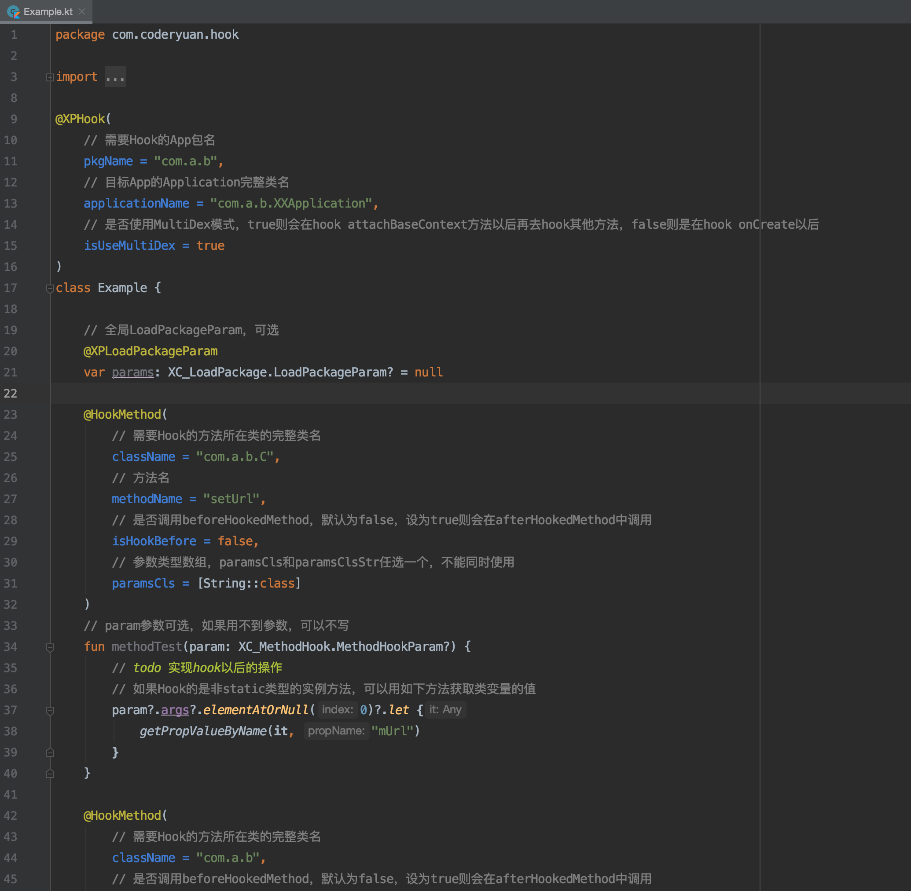

# coderyuan-xposed-hook

旨在为创建一个Xposed Hook提供一种更便捷的方法

## 开发Hook

- 首先clone：`git clone https://github.com/yuanguozheng/coderyuan-xposed-hook.git`

- 然后使用Android Studio打开，Gradle Sync通过

- 参考Example类实现自己的Hook

## 运行在手机上

- 准备一台ROOT后的手机，安装Xposed和Framework，参考：https://repo.xposed.info/module/de.robv.android.xposed.installer

- 如果不能安装，可以考虑VirtualXposed，参考：https://github.com/android-hacker/VirtualXposed

- 点击运行上面写好的Hook，然后重启手机（VirtualXposed执行内部重启）

- 运行需要Hook的App，即可在Logcat中打印日志